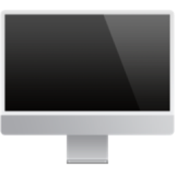

# Desktop Tools

Tools for doing stuff with things on your desktop.

## Copy from desktop

Copies the most recently created file on the desktop to the system clipboard.

* Keyword: `copd`

### Usage

This is primarily for inserting screenshots into apps like NotePlan or Obsidian, Slack, even Github comments and PR descriptions, pretty much anything that accepts images.

Take a screenshot with the macOS keyboard shortcuts, which place them on the desktop, then use this workflow to copy them to the clipboard as an image.

Can then paste it into anything that accepts images.
